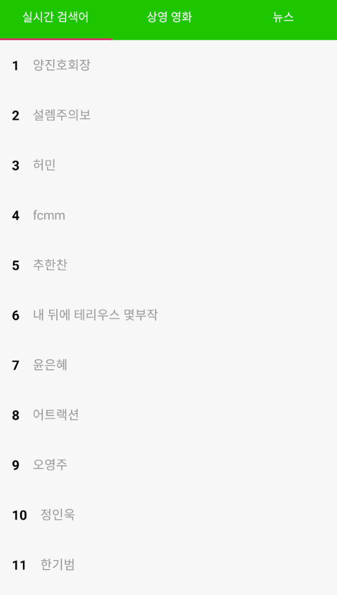
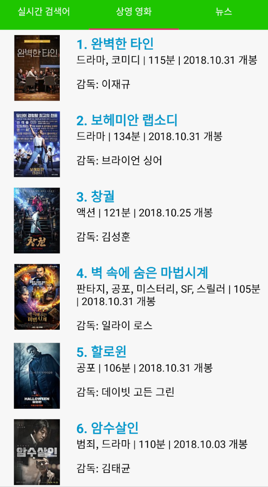
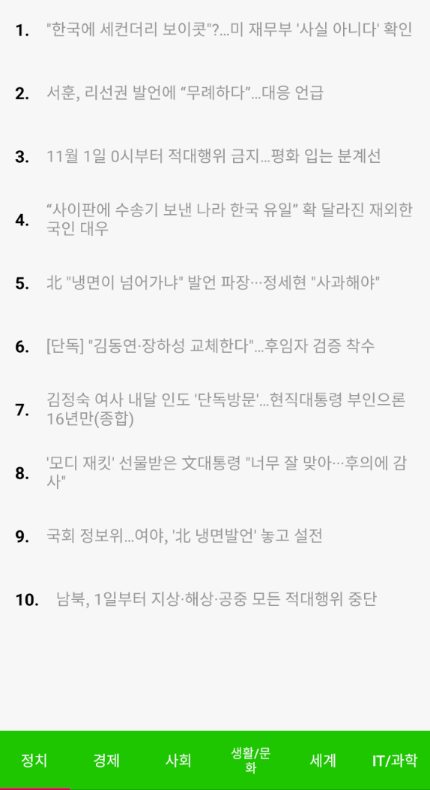

# Site Crawler

- 프로젝트명 : Site Crawler
- 관련 기술 : **Jsoup**, RecyclerView, Glide
- Github : https://github.com/WooVictory/Site-Crawler
- 내용 
1. 네이버 실시간 검색어(20개)
2. 현재 상영 중인 영화 목록
3. 네이버 뉴스(카테고리별로)

일상 생활에서 자주 사용하지만, 내용을 확인하기 위해서는 네이버, 상영 중인 영화 목록, 네이버 뉴스를 click 하여 들어가야 합니다. 물론 다른 내용이나 정보를 보기 위해서는 이와 같은 과정이 필요합니다. 이런 `번거로움`을 줄이고자 이 애플리케이션을 제작하게 되었습니다.


## 구현과정

* **Jsoup 라이브러리 사용**
    * **jsoup** 라이브러리를 사용하여 웹 페이지의 html을 파싱한다.
    * 웹 페이지의 html을 파싱하기 위해서 웹 페이지에 요청을 해야 하기 때문에 `AsyncTask`를 사용한다.
    * `Jsoup.connect(htmlUrl).get()`을 통해 요청을 보내고 element로 값을 받는다.
    * 다시 element.select("li dt[class=tit] a")와 같이 필요한 정보를 불러온다.

* RecyclerView 사용
    * jsoup을 사용해서 웹 페이지 html을 파싱해서 가져온 정보들을 단순히 view에 보여주지 않고 RecyclerView를 사용!
    * `ViewHolder`의 의무적 사용과 `layoutManager`를 이용해 수평, 수직, 그리드 형태 등의 다양한 리스트 구현이 가능.

* Glide 사용
    * 영화 목록을 보여줄 때 html을 파싱해서 받아온 이미지를 그대로 넣으면 OOM이 발생할 위험이 커진다.
    * 이유는 **이미지의 크기**가 얼마인지 모르기 때문!
    * OOM의 발생을 줄이기 위해, 큰 용량의 이미지를 간단하게 처리하기 위해 Glide 사용.

```kotlin
inner class MovieAsyncTask : AsyncTask<Any,Any, Any>(){

        private lateinit var progressDialog : ProgressDialog


        override fun onPreExecute() {
            super.onPreExecute()

            progressDialog = ProgressDialog(context!!)
            progressDialog.setProgressStyle(ProgressDialog.STYLE_SPINNER)
            progressDialog.setMessage("잠시만 기다려주세요:)")
            progressDialog.setCanceledOnTouchOutside(false)
            progressDialog.show()
        }

        override fun onPostExecute(result: Any?) {

            movieAdapter = MovieAdapter(movie_list, context!!)
            movieAdapter.setOnItemClick(this@MovieFragment)
            movieRv.adapter = movieAdapter
            movieRv.layoutManager = LinearLayoutManager(context!!)
            movieAdapter.notifyDataSetChanged()
            progressDialog.dismiss()

        }

        override fun doInBackground(vararg p0: Any?): Any? {
            try {
                var doc = Jsoup.connect(htmlMovieUrl).get()
                var element = doc.select("ul[class=lst_detail_t1]").select("li")
                var elementSize = element.size
                var cnt : Int = 0
                for(elements in element!!){
                    cnt++
                    var movieTitle : String = cnt.toString()+". "+ elements.select("li dt[class=tit] a").text() // 영화 제목
                    var movieLink : String = elements.select("li div[class=thumb] a").attr("href") // 영화 상세 링크
                    var movieImg : String = elements.select("li div[class=thumb] a img").attr("src") // 영화 썸네일 이미지

                    var rElem = elements.select("dl[class=info_txt1] dt").next().first()
                    var movieRelease = rElem.select("dd").text(); // 영화 개봉일
                    var dElem = elements.select("dt[class=tit_t2]").next().first()
                    var movieDirector = "감독: " + dElem.select("a").text(); // 영화 감독


                    movie_list.add(
                        MovieDatas(
                            movieTitle,
                            movieImg,
                            movieLink,
                            movieRelease,
                            movieDirector
                        )
                    ) // 리스트에 추가

                }
            }catch (e : Exception){
                e.printStackTrace()
            }
            return null
        }

    }
```
 


# 스크린샷

1. 실시간 검색어


2. 영화 목록


3. 뉴스

<!--
지원 이유
  이전부터 크롤링과 관련된 주제에 관심이 있었지만, 도전해 본 적은 없었습니다. 마침 핵데이에 소개된 주제를 보고 간단한 애플리케이션을 제작해보고 싶다는 마음이 생겼습니다. 그래서 저는 네이버에 들어가지 않고 네이버 실시간 검색어를 크롤링하여 20개까지 리스트로 출력하여 보여주는 앱을 제작했습니다. 

  아직 완성되지 않았지만, 저는 이번 핵데이에 지원을 해서 미완성 된 애플리케이션을 제작하여 사람들에게 편의를 주면서 복잡하지 않은 애플리케이션을 만들 싶습니다.  또한, 클라이언트 측에서 크롤링을 하는 방법에 대해서도 더욱 자세하게 알아보고 싶어서 지원하게 되었습니다. 
-->